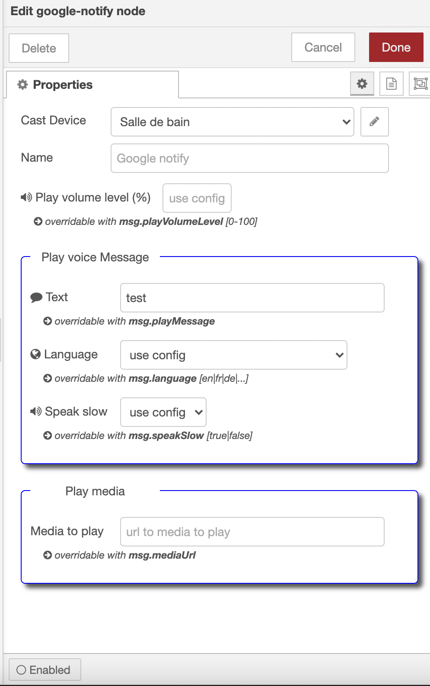

# node-red-google-notify

### Releases:
| Version   |Comment|
| ----------|:-------------:|
| 1.4.3     | new feature to clear all queues with pending notification & optimisations in pending messages management
| 1.4.2     | install instructions for node-red as add-on on hassio
| 1.4.1     | fix for language selection issue  
| 1.3.0     | notifications queueing / priority and stop playing  
| 1.2.2     | play media url as notification and GUI update 
| 1.1.2     | user overridable media server url
| 1.0.1     | Initial  release


### Description:

With this node you can cast text notification to any google cast device (e.g. google home, chrome cast ...)
The text of the **msg.playMessage** is converted to mp3 audio and stored in the cache folder. Each cast device can have it's own local media server or the same media server can be shared over all the cast devices. Thus the google cast device plays the mp3 notification from your device hosting node-red.
If the notification has to be played from an url then use **msg.mediaUrl**.
The mediaUrl has priority over **msg.playMessage**.

A played notification message is available to anyone by calling the url.
If you play the notifiation ** this is a test** then you will find a file in the cache folder named like 
```
THIS_IS_A_TEST-en-slow.mp3
```
* THIS_IS_A_TEST -> notification text (msg.payload)
* en -> english language
* slow -> speak speed can be slow/normal

This mp3 audio notification is then available at http://[ip]:[port]/THIS_IS_A_TEST-en-slow.mp3

While playing a notificaiton new arriving notifications are queued for processing.

Important notifications are played immediatly and the current played notification is stopped and queued.


### Features:
* **msg.playVolumeLevel**: The notification is played at defined volume level and the inital *volume level** of the casting device is **restored** after notification has been played.
The notification level can be defined in the device configuration and overriden anytime using msg.playVolumeLevel

* **msg.speakSlow**: The notification play speed can be defined as normal or slow. The speed can be set as default value in the node config or altered by the message msg.speakSlow = true

* **msg.language**: The language can also be altered with msg.language The list of available languages can be checked <a href="https://github.com/orcema/node-red-google-notify/blob/master/languages.js">here</a>

* **msg.important**: If a new arriving notificaiton has set msg.important=true then current playing notificaiton is stopped and queued and the important notification is processed immediately. After having played the important notifications the queued notification is replayed again. 

* **msg.command**: the value msg.command="stop" will stop the currently played notification and clear the queue.

* **msg.clearPending**: the value msg.clearPending=true will will remove all the pending notifications from the queue.

## notifiction play configuration sample
[](image.png)

## device config sample with default values for device
* IP Address: ip address of the casting device
* url: optional url if running within docker, else leave blank

[](image.png)


## Install instructions for node-red running as **add-on on Hassio**
Do not install from the "Manage Palette" within node-red but use the config file of the node-red add-on

[](image.png)
