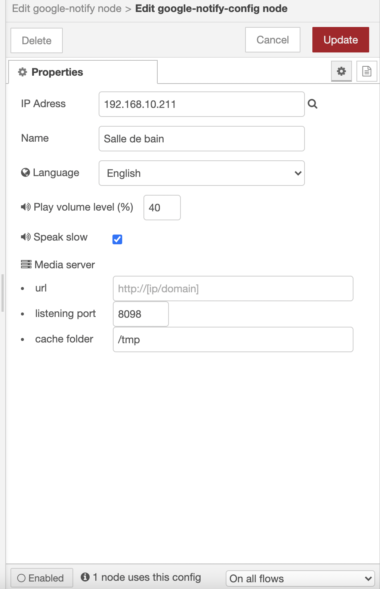

# node-red-google-notify

### Releases:
| Version   |Comment|
| ----------|:-------------:|
| 1.2.1     | play media url as notification and GUI update 
| 1.1.2     | user overridable media server url
| 1.0.1     | Initial  release


### Description:

With this node you can cast text notification to any google cast device (e.g. google home, chrome cast ...)
The text of the **msg.playMessage** is converted to mp3 audio and stored in the cache folder. Each cast device can have it's own local media server or the same media server can be shared over all the cast devices. Thus the google cast device plays the mp3 notification from your device hosting node-red.
If the notification has to be played from an url then use **msg.mediaUrl**.
The mediaUrl has priority over **msg.playMessage**.

A played notification message is available to anyone by calling the url.
If you play the notifiation ** this is a test** then you will find a file in the cache folder named like 
```
THIS_IS_A_TEST-en-slow.mp3
```
* THIS_IS_A_TEST -> notification text (msg.payload)
* en -> english language
* slow -> speak speed can be slow/normal

This mp3 audio notification is then available at http://[ip]:[port]/THIS_IS_A_TEST-en-slow.mp3


### Features:
* The notification is played at defined volume level and the inital **volume level** of the casting device is **restored** after notification has been played.
The notification level can be defined in the device configuration and overriden anytime using **msg.playVolumeLevel**

* The notification play speed can be defined as normal or slow. The speed can be set as default value in the node config or altered by the message **msg.speakSlow = true**

* The language can also be altered with **msg.language** The list of available languages can be checked <a href="https://github.com/orcema/node-red-google-notify/blob/master/languages.js">here</a>

## notifiction play configuration sample
[](image.png)

## device config sample with default values for device
* IP Address: ip address of the casting device
* url: optional url if running within docker, else leave blank


[](image.png)
